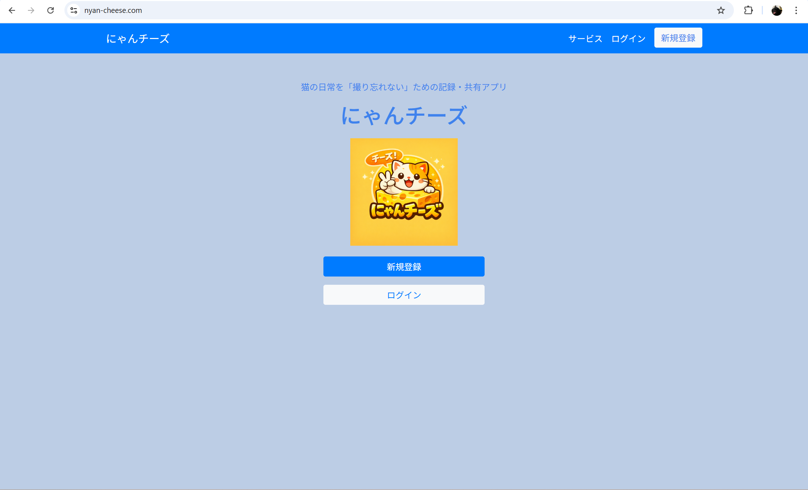
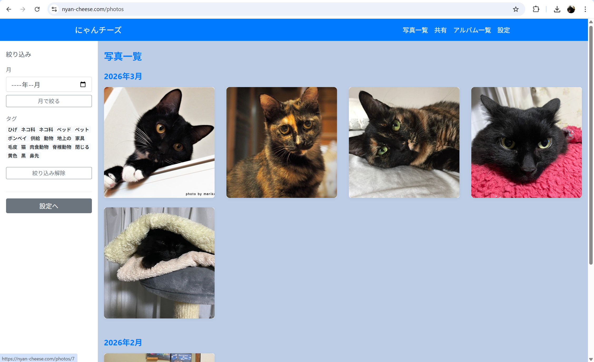
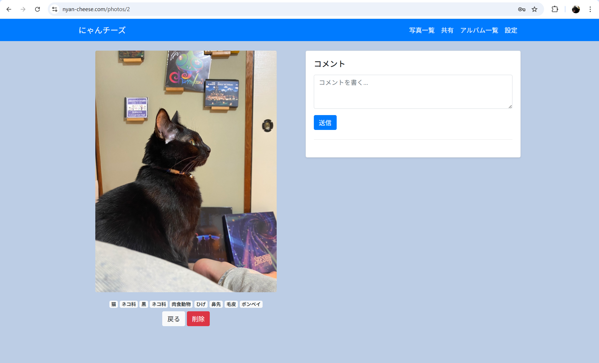
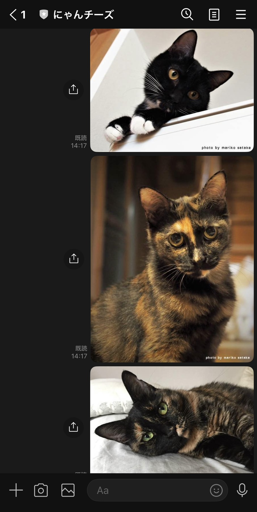
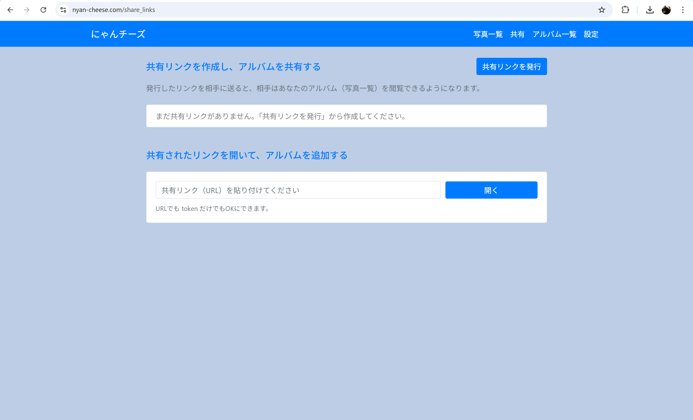
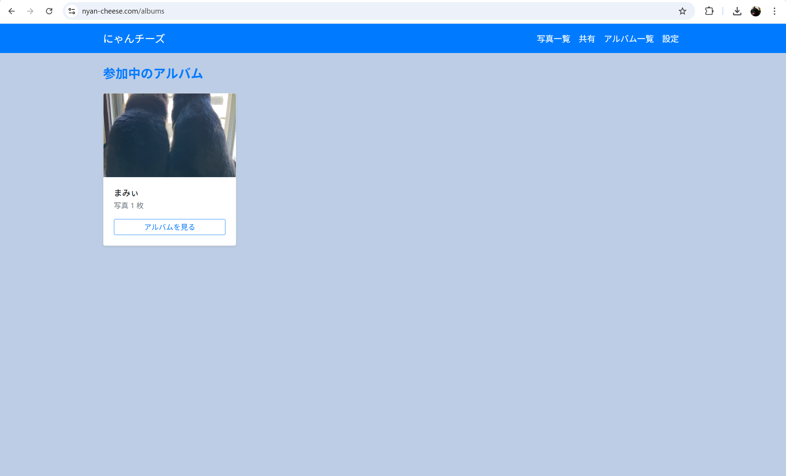

# にゃんチーズ
猫の“いつもの日常”を撮り忘れないための写真アルバムアプリです。
LINEから写真を送るだけで猫の写真を保存でき、家族など特定の人とアルバムを共有することができます。

## URL
https://nyan-cheese.com

### デモアカウント  
email: demo@test.com  
password: nyandemo

## スクリーンショット

|トップ画面|写真一覧|
|---|---|
|||

|写真詳細|LINE投稿|
|---|---|
|||

|共有機能|アルバム一覧|
|---|---|
|||

## 主な機能
### 写真投稿
・LINEから写真を送信すると自動でアプリに保存されます  

### 写真一覧
・猫の写真を一覧で管理 
・タグや日付で写真の絞り込みができます
・写真の詳細閲覧

### アルバム共有
・特定のユーザーとアルバムを共有可能  
・家族やパートナーと写真を共有できます

### AIタグ付け
・Google Cloud Vision APIを使用し写真を自動タグ付け

### 投稿リマインド
・一定期間投稿がない場合、LINEで通知
​
## 開発背景
にゃんチーズは、猫の日常を「撮り忘れない」ための記録・共有アプリです。

猫の何気ない仕草や表情は、気づいたときにはもう二度と同じ形では戻ってきません。
それにも関わらず、忙しい日常の中で写真を撮り忘れ、あとから「残しておけばよかった」と感じることがあります。

そこで普段使っている LINE から写真を送るだけで猫の日常を簡単に記録・共有できるアプリを作成しました。 
​
## ターゲットユーザー
- 猫の大切な日常を撮り忘れてしまう人
- 写真がスマートフォン内に散らばり、後から見返しづく困っている人
- 家族やパートナーと写真を共有したいが、不特定多数には公開したくない人
​
### 主な利用シーン
- 猫の何気ない日常を、LINEから手軽に記録したいとき
- 撮り忘れた後悔を減らしたいとき
- 家族やパートナーと、猫の今を静かに共有したいとき
- 後から成長や日常を振り返りたいとき
​

## 使用技術
### バックエンド
- Ruby
- Ruby on Rails

### フロントエンド
- HTML
- CSS
- JavaScript
- jQuery

### データベース
- MySQL

### インフラ
- AWS
  - EC2
  - RDS
  - S3

### API
- LINE Messaging API
- Google Cloud Vision API
​
## 開発環境
- OS：Windows
- 言語：HTML,CSS,JavaScript,Ruby,SQL
- フレームワーク：Ruby on Rails
- JSライブラリ：jQuery
- IDE：Visual Studio Code（VSCode）
​
## 工夫した点
・LINEから写真を送るだけで投稿できるようにし、簡単に使えるUXを意識しました。  
・AIによるタグ付けを導入することで、写真を自動で整理できるようにしました。  
・一定期間投稿がない場合に通知を行うことで、猫の日常を継続的に記録できる仕組みを作り、「写真を撮らなかった後悔」が残らないようにしました。

## 開発環境
OS：Windows  
IDE：Visual Studio Code